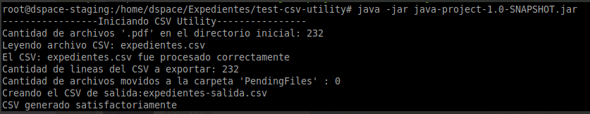

# CSV Utility

#### Steps to use the tool
-This app use the path where the jar is located.

-All pdf must be in the same folder of the jar.
-The Input CSV must be in the same folder of the jar too, and must be named "expedientes.csv"

1-Create an instance of CSVUtility class.
CsvUtility csv = new CsvUtility();

2-Get the Map with all files in the directory <String filename, File>
-only checks for .pdf files
Map<String, File> files = csv.getFilesHM();

3-Read all lines of the input CSV
csv.readInputCSV();

4-Sanitize and filter the CSV
-Clean the CSV using the files list of the step 2
Map<String, String[]> cleanCsvHM = csv.sanitizeInputCSV();

5-Clean directory and move pending files to another folder
-all pdf that is not included in the csv it is moved to another folder
int pendientes = csv.sanitizeDirectory();

6-Export the output CSV
-this new CSV is a filter of the CSV of the step 3 with the columns names according to dublin core fields,
those keys are the column names in the input CSV and the value is the column name of the output CSV

boolean result = csv.writeNewCsv();

f.put("ID", "filename");

f.put("No. de caja", "dc.format");

f.put("Secuencia de expedientes", "dc.identifier.isbn");

f.put("No. de expediente", "dc.identifier");

f.put("Contenido", "dc:description");

f.put("Fecha", "dc:date");

f.put("No. de Ley/Resolución/Decreto", "dc.identifier.govdoc");

f.put("Observaciones", "dc.description.tableofcontents");

f.put("Tipo de Iniciativa", "dc.identifier.other");

f.put("Resolución / contrato", "dc.type");

f.put("Titulo", "dc.title");

f.put("Proponentes", "dc.provenance");

f.put("Comision", "dc.subject");

f.put("Sesiones", "dc.description.sponsorship");

